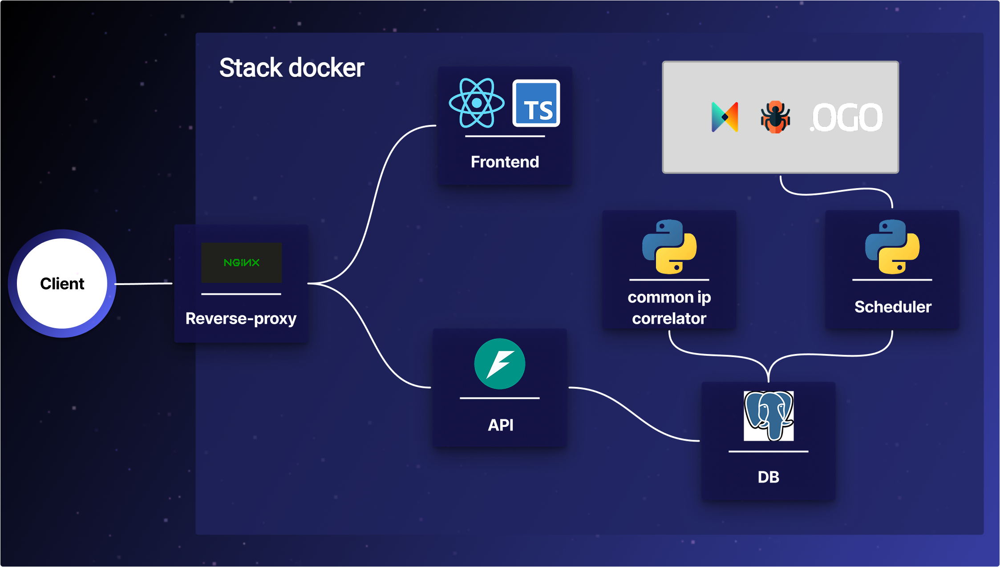

# Dashboard cyber déploiement

## Aperçu

Ce dépôt permet de déployer un dashboard de cyber, qui corrèle des addresses IP issues de différentes sources (OGO, Serenicity).
Pour cela, l'application orchestre plusieurs projets GitHub packagés sous forme d'images Docker. 

**Chaque module a une responsabilité**
| Module | GitHub | Docker Hub | Responsabilité |
| --- | --- | --- | --- |
| Frontend | [GitHub](https://github.com/dev-vauclaire/cyber-dashboard-frontend) | [Docker Hub](https://hub.docker.com/repository/docker/devauclaire/cyber-dashboard-frontend/general) | Interface web |
| API | [GitHub](https://github.com/dev-vauclaire/cyber-dashboard-api.git) | [Docker Hub](https://hub.docker.com/r/devauclaire/cyber-dashboard-api) | API |
| Scheduler | [GitHub](https://github.com/dev-vauclaire/cyber-dashboard-scheduler.git) | [Docker Hub](https://hub.docker.com/r/devauclaire/cyber-dashboard-scheduler) | Récupère périodiquement les IP |
| Common IP Correlator | [GitHub](https://github.com/dev-vauclaire/cyber-dashboard-common-ip.git) | [Docker Hub](https://hub.docker.com/r/devauclaire/cyber-dashboard-common-ip) | Corrélation des adresses IP communes |
| Base de données | Image officielle PostgreSQL | [Docker Hub](https://hub.docker.com/_/postgres) | Base de données |
| Reverse proxy | Image officielle Nginx | [Docker Hub](https://hub.docker.com/_/nginx) | Reverse proxy |

## Architecture



Flow de la stack : 
1. Le **scheduler** récupère périodiquement les adresses IP depuis les APIs OGO et Serenicity, et les stocke dans la base de données.
2. Le **common IP correlator** récupère les nouvelles adresses IP stockées, les compares avec les adresses IP déjà présentes dans sa mémoire RAM. Si il trouve une addresse commune à plusieurs sources, il stocke cette information sous forme d'alerte dans la base de données.
3. l'**API** expose les données de la BDD.
4. Le **reverse proxy** reçoit les requêtes HTTP, les redirige vers l'API ou le frontend selon le chemin d'accès, et gère la sécurité et les certificats SSL.
5. Le **frontend** interroge l'API pour afficher les données et les alertes de corrélation à l'utilisateur.

## Installation

### Prérequis

- Linux, Ubuntu recommandé (amd64)
- Docker et Docker Compose installés
- Pour OGO :
    - URL de base de l'API OGO
    - username OGO
    - Clé API OGO
    - Nom ou identifiant du site OGO à synchroniser
- Pour Serenicity :
    - URL de base de l'API Serenicity
    - Clé API Serenicity

### 1. Cloner le repository

```bash
git clone https://github.com/dev-vauclaire/cyber-dashboard-deploy.git
cd cyber-dashboard-deploy
```

### 2. Créer manuellement le fichier `.env`

La stack lit sa configuration depuis un fichier `.env` placé à la racine du dossier de déploiement.

#### Variables d'environnement

| Variable | Description | Exemple |
| --- | --- | --- |
| `POSTGRES_USER` | Utilisateur PostgreSQL créé au démarrage | `cyber_dashboard` |
| `POSTGRES_PASSWORD` | Mot de passe PostgreSQL | `change-me` |
| `POSTGRES_DB` | Nom de la base de données PostgreSQL | `cyber_dashboard` |
| `DB_HOST` | Hôte PostgreSQL utilisé par les services applicatifs | `db` |
| `DB_PORT` | Port PostgreSQL utilisé par les services applicatifs | `5432` |
| `API_NAME` | Nom affiché ou utilisé par l'API | `Cyber Dashboard API` |
| `API_HOST` | Adresse d'écoute de l'API dans le conteneur | `0.0.0.0` |
| `API_PORT` | Port d'écoute de l'API dans le conteneur | `8000` |
| `API_LOG_LEVEL` | Niveau de logs de l'API | `INFO` |
| `LIMIT_REQUEST_PER_DAY` | Limite de requêtes par jour vers les APIs externes | `24` |
| `LOG_LEVEL` | Niveau de logs du scheduler | `INFO` |
| `HTTP_TIMEOUT_SECONDS` | Timeout HTTP des appels externes | `10` |
| `POLL_SAFETY_WINDOW_SECONDS` | Fenêtre de sécurité pour la récupération périodique | `300` |
| `OGO_BASE_URL` | URL de base de l'API OGO | `https://example.ogo.local` |
| `OGO_USERNAME` | Identifiant OGO | `user@example.com` |
| `OGO_API_KEY` | Clé API OGO | `change-me` |
| `OGO_SITE_NAME_OR_ID` | Nom ou identifiant du site OGO à synchroniser | `www.example.com` |
| `SERENICITY_BASE_URL` | URL de base de l'API Serenicity | `https://example.serenicity.local` |
| `SERENICITY_API_KEY` | Clé API Serenicity | `change-me` |
| `CORRELATOR_BATCH_SIZE` | Nombre d'éléments traités par lot | `500` |
| `CORRELATOR_POLL_INTERVAL_SECONDS` | Intervalle entre deux traitements | `10` |
| `CORRELATOR_LOG_LEVEL` | Niveau de logs du corrélateur | `INFO` |
| `CORRELATOR_COMPUTE_AVERAGE_PROCESSING_TIME` | Active le calcul du temps moyen de traitement | `false` |

#### Créer `.env` depuis `.env.example`

```bash
cp .env.example .env
nano .env
```

Adaptez ensuite les valeurs en fonction de votre usage

### 3. Lancer la stack

Commande Docker Compose :

```bash
docker compose -f docker-compose.prod.yaml up -d
```

### 4. HTTPS avec certificat entreprise / PKI interne

Le reverse proxy Nginx termine le TLS : les clients se connectent en HTTPS sur Nginx, puis Nginx redirige les requêtes vers le frontend ou l'API sur le réseau Docker interne.

Les certificats doivent être fournis par l'équipe IT, ou générés via une CSR puis signés par la PKI interne. Les fichiers attendus sont :

```text
certs/fullchain.pem
certs/privkey.pem
```

Ces fichiers ne doivent jamais être commités. Le dossier `certs/` sert uniquement à monter les certificats réels dans le conteneur Nginx.

Permissions recommandées :

```bash
chmod 600 certs/privkey.pem
chmod 644 certs/fullchain.pem
```

#### Générer une CSR

Si l'équipe IT demande une CSR, vous pouvez générer une clé privée et une demande de certificat :

```bash
openssl req -new -newkey rsa:4096 -nodes \
  -keyout certs/privkey.pem \
  -out certs/cyber-dashboard.csr \
  -subj "/CN=cyber-dashboard.example.local"
```

Le fichier `certs/cyber-dashboard.csr` doit ensuite être transmis à l'équipe IT pour signature. Le certificat signé doit être placé dans `certs/fullchain.pem` et la clé privée dans `certs/privkey.pem`.

> Nom DNS = Nom certificat = Nom utilisé dans navigateur

### 5. Vérifier les services

Vérifier l'état des conteneurs :

```bash
docker compose -f docker-compose.prod.yaml ps
```

### 6. Accéder à l'app

Une fois la stack démarrée, l'application est disponible à l'adresse suivante :

```text
https://Nom_DNS/
```

ou

```text
https://Adresse_IP/
```

## À faire

- [ ] Sécuriser les variables sensibles
- [ ] Ajouter un mode d'authentification
