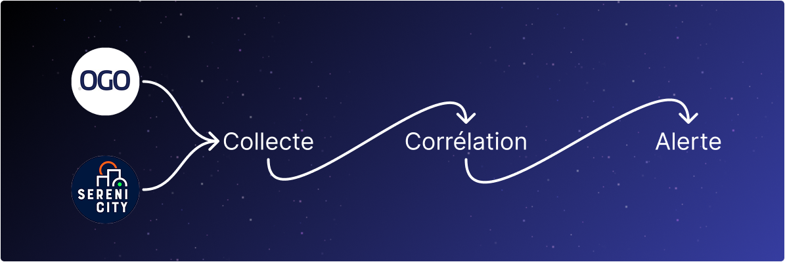
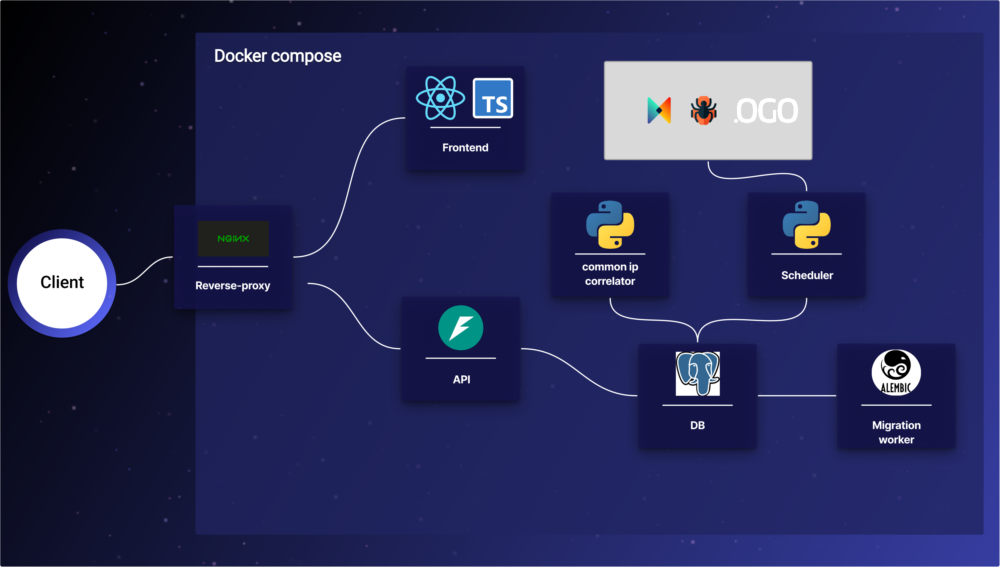

# Cyber Dashboard Deploy

Ce projet contient les fichiers et la documentation nécessaires pour déployer l'application Cyber Dashboard.
Ce README est séparé en 3 parties selon ce que vous souhaitez faire : 
  - Avoir un aperçu de l'application et de son architecture
  - Déployer l'application from scratch
  - Mettre à jour l'application

## Sommaire

- [Présentation de l'application](#présentation-de-lapplication)
  - [Architecture](#architecture)
- [Déploiement from scratch](#déploiement-from-scratch)
  - [Prérequis](#prérequis)
  - [1. Préparer la clé maître](#1-préparer-la-clé-maître)
  - [2. Configurer les variables d'environnement](#2-configurer-les-variables-denvironnement)
  - [3. Préparer HTTPS](#3-préparer-https)
  - [4. Démarrer la stack](#4-démarrer-la-stack)
- [Mettre à jour l'application](#mettre-à-jour-lapplication)
  - [1. Sauvegarder la base de données](#1-sauvegarder-la-base-de-données)
  - [2. Arrêter la stack](#2-arrêter-la-stack)
  - [3. Récupérer les nouvelles versions et fichiers du dépôt](#3-récupérer-les-nouvelles-versions-et-fichiers-du-dépôt)
  - [4. Mettre à jour le fichier `.env`](#4-mettre-à-jour-le-fichier-env)
  - [5. Télécharger les images et redémarrer](#5-télécharger-les-images-et-redémarrer)
  - [6. Nettoyage des images et conteneurs obsolètes](#6-nettoyage-des-images-et-conteneurs-obsolètes)
- [Vérifier la stack](#vérifier-la-stack)

## Présentation de l'application

Cyber Dashboard sert à détecter si vos différents systèmes 
informatiques supervisés par OGO et serenicity
subissent une attaque commune.

L'application s'organise en 3 axes principaux :

1. **Collecte** : Un scheduler (planifieur) récupère les journaux 
  d'attaques de vos outils de cybersécurité `ogo` et `serenicity`.
2. **Corrélation** : Un corrélateur lit les journaux d'attaques et lève une alerte si une même adresse 
  IP est détectée par des outils différents.
3. **Mise à disposition** : Un dashboard web permet une visualisation de vos données collectées et corrélées.



### Architecture

La stack est composée de plusieurs conteneurs le tout orchestré par Docker Compose, chacun ayant un rôle dédié.

| Service Compose | Rôle |
| --- | --- |
| `db` | Stocke les attaques, les alertes, les sources et la configuration applicative. |
| `migrate` | Exécute les migrations Alembic au démarrage si nécessaire. |
| `api` | Expose l'API utilisée par le frontend. |
| `scheduler` | Réalise des inventaires d'outils de cyber et collecte leurs journaux d'attaques. |
| `common-ip-correlator` | Encapsule une hashmap pour corréler les adresses IP communes entre plusieurs sources. |
| `frontend` | Sert l'interface utilisateur. |
| `reverse-proxy` | Termine le TLS et route le trafic vers le frontend ou l'API. |

Le code source est disponible dans deux dépôts distincts :

| Composant | Dépôt |
| --- | --- |
| Frontend | [cyber-dashboard-frontend](https://github.com/dev-vauclaire/cyber-dashboard-frontend) |
| API, scheduler, corrélateur et migrations | [cyber-dashboard-backend](https://github.com/dev-vauclaire/cyber-dashboard-backend) |



## Déploiement from scratch

Commencez par cloner le dépôt et placez-vous dans le dossier `cyber-dashboard-deploy`.

```bash
git clone https://github.com/dev-vauclaire/cyber-dashboard-deploy.git
cd cyber-dashboard-deploy
```

Toutes les commandes suivantes doivent être exécutées depuis le dossier `cyber-dashboard-deploy`.

### Prérequis

- Un hôte Linux est recommandé.
- Docker Engine et [Docker Compose](https://docs.docker.com/compose/install/linux/) doivent être installés.
- Les ports `80` et `443` doivent être disponibles sur l'hôte.
- Un fichier [`postgres/init.sql`](postgres/init.sql) vide doit être présent.
- Prévoyez au minimum les ressources suivantes pour la stack complète :
  - RAM : 6 Go
  - CPU : 2 vCPU
  - Disque : 32 Go

### 1. Préparer la clé maître

Générez une clé maître et placez-la dans le dossier `secrets` à la racine du projet.
Cette clé est utilisée pour chiffrer les secrets stockés en base de données.

```bash
python3 -c 'import base64, os; print(base64.urlsafe_b64encode(os.urandom(32)).decode())' > secrets/cyber_dashboard_secret_key
chmod 644 secrets/cyber_dashboard_secret_key
```

Vérification de la création de la clé :

```bash
cat secrets/cyber_dashboard_secret_key
```

> ⚠️ Il est recommandé de sauvegarder cette clé dans un coffre-fort sécurisé. La perte de cette clé rendra les secrets stockés en base de données irrécupérables.

### 2. Configurer les variables d'environnement

Créez le fichier `.env` à partir de l'exemple fourni :

```bash
cp .env.example .env
```

Modifiez ensuite uniquement les variables référencées ci-dessous dans `.env` avec les valeurs de production.

| Variable | Description |
| --- | --- |
| `POSTGRES_USER` | Nom d'utilisateur de la base PostgreSQL |
| `POSTGRES_PASSWORD` | Mot de passe de la base PostgreSQL |
| `POSTGRES_DB` | Nom de la base PostgreSQL |

Permissions recommandées pour le fichier `.env` :

```bash
chmod 600 .env
```

### 3. Préparer HTTPS

Procurez-vous un [certificat TLS](https://aws.amazon.com/fr/what-is/ssl-certificate/) validé par votre autorité de certification
pour votre domaine et placez les fichiers dans le dossier `certs` à la racine du projet.
Nginx attend les fichiers suivants :

```text
certs/fullchain.pem
certs/privkey.pem
```

Si vous souhaitez utiliser un certificat auto-signé, vous pouvez utiliser la commande suivante :

```bash
openssl req -x509 -nodes -days 365 -newkey rsa:2048 -keyout certs/privkey.pem -out certs/fullchain.pem -subj "/CN=localhost"
```

Permissions recommandées :

```bash
chmod 644 certs/fullchain.pem
chmod 600 certs/privkey.pem
```

### 4. Démarrer la stack

```bash
docker compose up -d
```

Depuis une autre machine, vérifiez si le site est accessible
via HTTPS sur le port 443.

```text
https://<ip-de-votre-serveur> ou https://<votre-domaine> si vous avez configuré un nom de domaine.
```

> ⚠️ Pour vérifier que les services tournent correctement : [Vérifier la stack](#vérifier-la-stack).

## Mettre à jour l'application

### 1. Sauvegarder la base de données

Avant d'arrêter la stack, je vous recommande d'exporter la base de donnée dans le cas où une migration échouerait :

```bash
mkdir -p backups
docker compose exec -T db sh -c 'pg_dump -U "$POSTGRES_USER" "$POSTGRES_DB"' > backups/backup.sql
```

> ⚠️ Mesure de prévention

### 2. Arrêter la stack

```bash
docker compose down
```

### 3. Récupérer les nouvelles versions et fichiers du dépôt

```bash
git pull
```

Cette commande met à jour les fichiers du dépôt, notamment `docker-compose.yaml` et `.env.example`.

### 4. Mettre à jour le fichier `.env`

Comparez votre fichier `.env` avec `.env.example` :

- si de nouvelles variables sont apparues dans `.env.example`, ajoutez-les dans `.env` ;
- si des variables ont été supprimées de `.env.example`, retirez-les de `.env` ;

### 5. Télécharger les images et redémarrer

```bash
docker compose up -d
```

> ⚠️ Le redémarrage de la stack peut prendre quelques minutes, le temps que les migrations s'exécutent.

### 6. Nettoyage des images et conteneurs obsolètes

> ⚠️ Ne la lancer qu'après avoir vérifié que la nouvelle stack fonctionne correctement. [Vérifier la stack](#vérifier-la-stack)

Cette commande supprime les conteneurs arrêtés

```bash
docker container prune
```

Cette commande supprime les images obsolètes

```bash
docker image prune -a
```

## Vérifier la stack

Vérifiez que les services sont bien en statut `Up` avec la commande suivante :

```bash
docker compose ps -a
```

Seul le service de migration devrait être en statut `Exited`.
